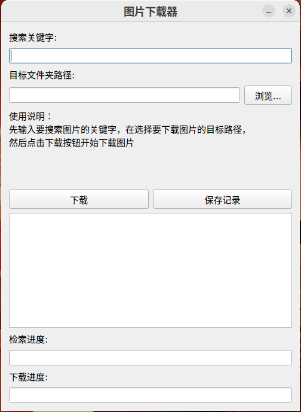
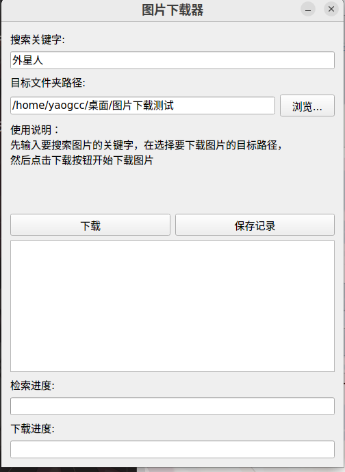
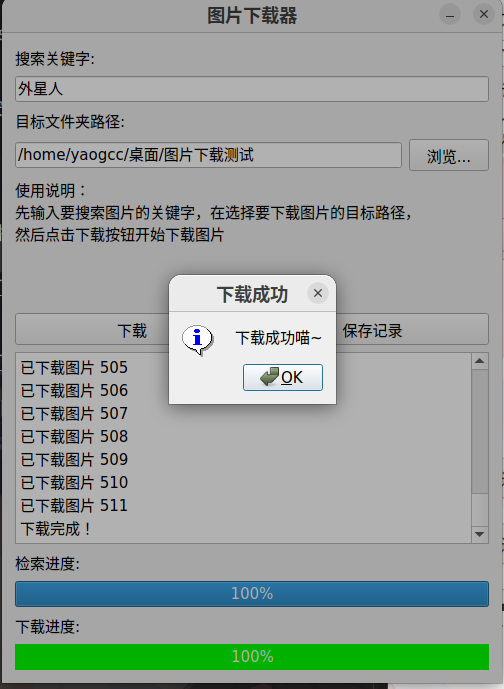
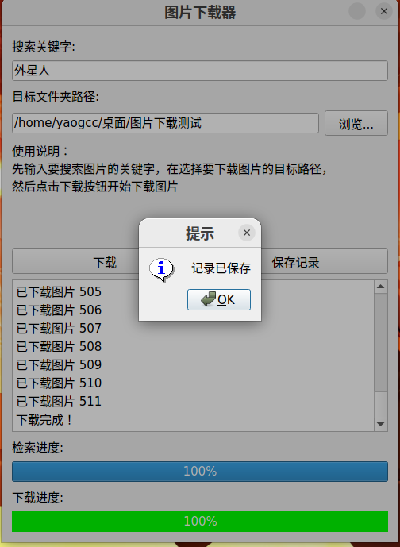

<div lang="zh">
---

# 图片下载应用

## 项目简介

图片下载应用是一个基于Python和Qt框架开发的应用程序，旨在帮助用户轻松地搜索、选择和下载互联网上的图片资源。通过简洁直观的界面和强大的功能，用户可以快速获取他们感兴趣的图片，适用于个人收藏、项目素材等多种用途。

## 注意事项

- ***本应用程序仅供个人学习和非商业用途，请勿用于商业目的。***
- ***下载的图片可能受版权保护，请确保在合法范围内使用。***
- ***如有任何问题或建议，请联系开发团队，我们将尽力提供支持和改进。***


## 主要功能

- **搜索图片：** 用户可以通过输入关键词来搜索图片，并获取相关的图片结果。
- **预览功能：** 应用程序提供图片预览功能，让用户在下载前可以查看图片详情。
- **批量下载：** 用户可以选择多张图片进行批量下载，提高下载效率。
- **保存搜索记录：** 应用程序支持保存搜索记录，方便用户查看和管理搜索历史。

## 版本说明

- **当前版本有windows完整版代码，下载器纯净代码，和可运行exe文件**

## 使用方式

1. **输入关键词：** 在搜索框中输入你感兴趣的图片关键词。
2. **浏览结果：** 浏览搜索结果，选择你想要下载的图片。
3. **下载图片：** 点击下载按钮，将选择的图片保存到本地设定的目标文件夹中。
4. **保存记录：** 可以选择保存搜索记录，方便以后查看或重新搜索。

## 技术实现

- **Python编程：** 使用Python编写核心逻辑和数据处理部分。
- **Qt框架：** 基于Qt框架开发用户界面，提供良好的交互体验。
- **网络请求：** 使用Python的网络请求库从互联网获取图片数据。
- **图形界面设计：** 利用Qt Designer等工具设计和布局应用程序界面。


## 环境配置

- ### **exe文件可以直接执行**
    
    ***可以直接在windows环境下运行***

- ### **编译代码运行**

    ***用编译器执行需要安装必要环境依赖，执行以下命令***

    ```
    pip install -r requirements.txt
    ```

    ***另外需要下载edge版本的msedriver***
    
    `driver_path = '/usr/local/bin/msedgedriver'#这里更改你的msedriver路径`

## 操作说明

- **1.运行exe或者在编译器执行，出现以下界面，无法运行或报错退出代 表无法运行该程序**


- **2.按照使用说明操作**


- **3.点击下载即可开始下载图片到目标目录**


- **4.点击保存记录可以保存当前搜索记录**

---
<div lang="en">


# Image Downloader

## Project Introduction

The Image Downloader is an application developed based on Python and the Qt framework, aiming to assist users in easily searching, selecting, and downloading images from the internet. With a clean and intuitive interface and powerful features, users can quickly obtain the images they are interested in, suitable for various purposes such as personal collections, project materials, and more.

## Notes

- ***This application is for personal learning and non-commercial use only. Please do not use it for commercial purposes.***
- ***Downloaded images may be subject to copyright protection. Please ensure legal use.***
- ***If you have any questions or suggestions, please contact the development team. We will do our best to provide support and improvements.***

## Key Features

- **Search Images:** Users can search for images by entering keywords and get related image results.
- **Preview Functionality:** The application provides image preview functionality, allowing users to view image details before downloading.
- **Batch Download:** Users can select multiple images for batch downloading to improve efficiency.
- **Save Search Records:** The application supports saving search records for users to view and manage search history.

## Version Description

- **The current version includes complete code for Windows, clean code for the downloader, and an executable (.exe) file.**

## Usage

1. **Enter Keywords:** Enter your interested image keywords in the search box.
2. **Browse Results:** Browse search results and select the images you want to download.
3. **Download Images:** Click the download button to save the selected images to the target folder on your local device.
4. **Save Records:** You can choose to save search records for future viewing or re-searching.

## Technical Implementation

- **Python Programming:** Core logic and data processing are implemented using Python.
- **Qt Framework:** User interface development is based on the Qt framework to provide a good interactive experience.
- **Network Requests:** Python's network request libraries are used to fetch image data from the internet.
- **GUI Design:** Design and layout of the application's graphical user interface are achieved using tools like Qt Designer.

## Environment Configuration

- ### **Running the .exe File**
    
    ***You can directly execute it in a Windows environment.***

- ### **Running the Compiled Code**

    ***Executing the code with a compiler requires installing necessary environment dependencies. Run the following command:***
    
    ```
    pip install -r requirements.txt
    ```
    
    ***Also, make sure to download the Edge version of the msedgedriver.***
    
    `driver_path = '/usr/local/bin/msedgedriver'  # Change this to your msedgedriver path`

## Operation Instructions

- **1. Run the .exe file or execute in a compiler. If the following interface appears, failure to run or exiting with an error indicates that the program cannot run.**


- **2. Follow the instructions for use.**


- **3. Click "Download" to start downloading images to the target directory.**


- **4. Click "Save Record" to save the current search record.**


---
</div>